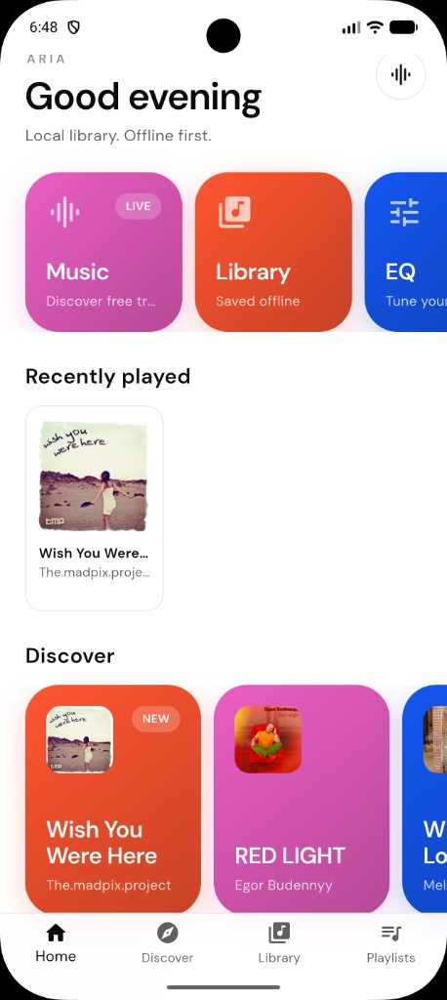
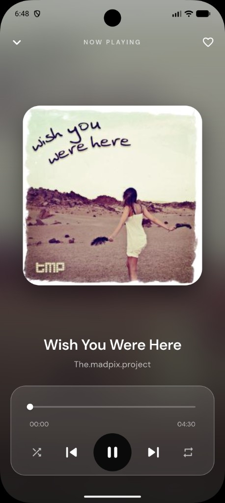

# Aria

Offline-first music player for **iOS** and **Android**.

Discover free tracks, save them locally, build playlists, and keep listening with Lock Screen / Dynamic Island controls.

<p align="center">
  
  &nbsp;&nbsp;
  
</p>

## Features

- **Discover** — search Jamendo and save tracks offline  
- **Library** — local library, likes, and file import  
- **Playlists** — create and organize queues  
- **Now Playing** — full-screen player with shuffle / repeat / like  
- **Equalizer** — visual EQ (realtime on Android)  
- **Live Activities** — iOS Lock Screen + Dynamic Island  
- **Widgets** — home-screen now playing on iOS and Android  

## Requirements

- Flutter **3.35+** / Dart **3.9+**  
- Xcode with a paid Apple Developer team for App Store builds  
- Physical iPhone for Live Activities testing (iOS 16.1+)  

## Setup

```bash
flutter pub get
dart run flutter_launcher_icons
dart run flutter_native_splash:create
flutter run
```

### API keys (optional overrides)

Defaults work for development. For production builds:

```bash
flutter build ipa --release \
  --dart-define=JAMENDO_CLIENT_ID=your_client_id \
  --dart-define=THEAUDIODB_KEY=your_key
```

## App Store / release

| | |
|---|---|
| **Display name** | Aria |
| **Bundle ID** | `com.anurag.studio` |
| **Widget extension** | `com.anurag.studio.AriaWidgets` |
| **App Group** | `group.com.anurag.studio` |

```bash
# iOS App Store IPA
./scripts/release.sh ios

# Android Play (optional)
./scripts/release.sh aab
```

**iOS checklist**

1. Open `ios/Runner.xcworkspace` in Xcode  
2. Signing → your Apple Developer team on **Runner** and **AriaWidgets**  
3. Confirm App Groups `group.com.anurag.studio` on both targets  
4. Archive / upload via Xcode or `flutter build ipa`  

## Project structure

```
lib/core/         theme, DI, shared widgets
lib/features/     home, player, library, playlist, discover, equalizer
assets/branding/  app icon & splash
assets/seed/      first-launch demo tracks
ios/AriaWidgets/  WidgetKit + Live Activities
```

## License

Private / all rights reserved.
